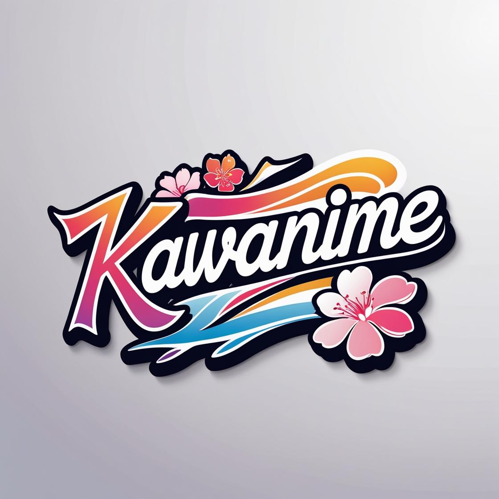

<p align="center">
  
</p>
<p align="center">
	<h1 align="center">KAWANIME V2.0</h1>
</p>
<br/>

## Overview


---

## KawaNime v2.0

-   Konversi video mp4 ke hls untuk multi resolusi
-   Perbaikan fitur watch page
-   Perbaikan fitur pencarian
-   Perbaikan fitur login
-   Perbaikan fitur register
-   Redisain UI

## Memulai

### Persyaratan

Sebelum memulai dengan KawaNime, pastikan lingkungan pengembangan Anda memenuhi persyaratan berikut:

-   **Bahasa Pemrograman:** Vue.js, Laravel, Tailwind
-   **Package Manager:** Npm, Composer

### Instalasi

Instal KawaNime dengan salah satu metode berikut:

1. Clone repositori KawaNime:

```sh
❯ git clone https://github.com/DewaJayon/KawaNime-new
```

2. Masuk ke direktori proyek:

```sh
❯ cd KawaNime
```

3. Install dependensi proyek:

**Dengan `npm`** &nbsp;

```sh
❯  npm install
```

**Menggunakan `composer`**

```sh
❯ composer install
```

**Konfigurasi `.env`**

```sh
❯ cp .env.example .env
```

**Jalankan Aplikasi `terminal (Satu persatu)`**

```sh
❯ php artisan serve, npm run dev, php artisan migrate, php artisan db:seed, php artisan storage:link, php artisan queue:work
```
